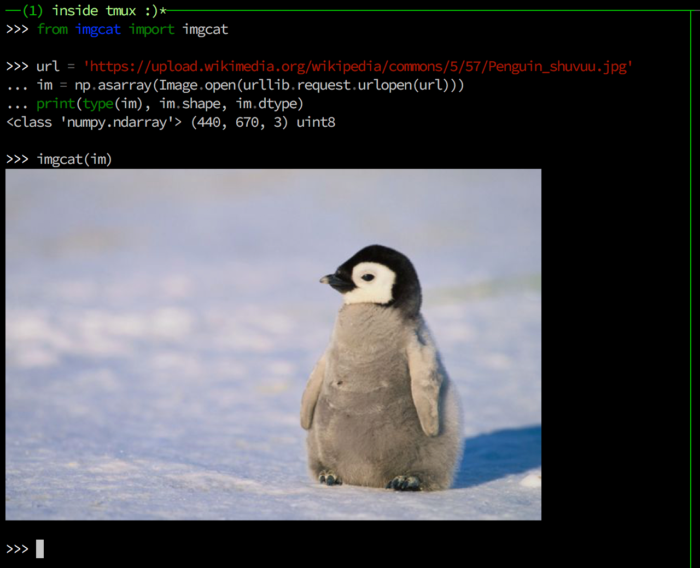

`imgcat`
========

The imgcat CLI, written in Python (and Python API, too).



It works with [iTerm2](https://www.iterm2.com/documentation-images.html), and even inside tmux.


Installation and Usage
----------------------

```
pip install imgcat
```

Command-line interface (similar to [iTerm2's imgcat][iTerm2_imgcat]):

```bash
$ imgcat local_image.png
$ imgcat a.png b.png c.png
$ cat from_stdin.gif | imgcat

# height is 10 lines
$ imgcat a.png --height 10
```

Python API:

```python
>>> from imgcat import imgcat

# from the content of image (e.g. buffer in python3, str in python2)
>>> imgcat(open("./local_image.png"))

# or numpy arrays!
>>> im = skimage.data.chelsea()   # [300, 451, 3] ndarray, dtype=uint8
>>> imgcat(im, height=7)

# matplotlib, PIL.Image, etc.
>>> imgcat(Image.fromarray(im))

>>> import matplotlib.pyplot as plt
>>> fig, ax = plt.subplots(); ax.plot([1, 2, 3, 4, 5])
>>> imgcat(fig)
```

Notes
-----

* Currently tmux 2.5+ cannot display big images. Use tmux <= 2.4 or run outside tmux.
* TODO: General platform/emulator support (introduce multiple backends)


Related Projects
----------------

* Original implementation: [imgcat][iTerm2_imgcat] from iTerm2  (limited tmux support)
  * A modified version with better tmux support by [Eric Dobson](https://gitlab.com/gnachman/iterm2/issues/3898#note_14097715) and [@krtx](https://gist.github.com/krtx/533d33d6cc49ecbbb8fab0ae871059ec)
* Node.js: [term-img](https://github.com/sindresorhus/term-img) (no tmux support)
* Go: [iterm2-imagetools](https://github.com/olivere/iterm2-imagetools) (no tmux support)


[iTerm2_imgcat]: https://github.com/gnachman/iTerm2/blob/master/tests/imgcat


License
-------

MIT License
